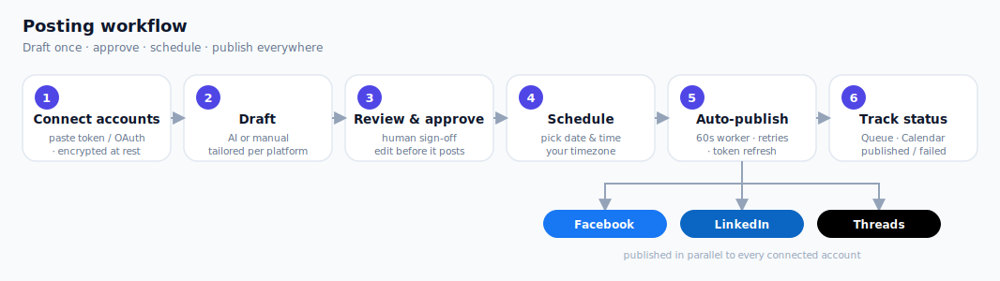

# 📣 Social Media Auto-Posting Agent — Schedule Once, Publish Everywhere

**I'll set up an automation that drafts, schedules, and auto-publishes your content to
Facebook, LinkedIn, and Threads — from one simple dashboard, with AI doing the heavy
lifting on the writing.**

Stop logging into three apps and copy-pasting the same post. Write once (or let AI
draft it), approve, pick a time — and it goes out automatically, even while you sleep.

---

## ✅ What this service does for you

- **Post to 3 platforms in one action** — Facebook Pages, LinkedIn, and Threads.
- **AI writes your first draft** — tailored per platform, with the right length and tone for each.
- **Images & video too** — attach a photo carousel or a video; it's published natively to each platform.
- **You stay in control** — every post waits for your one-click approval before anything publishes.
- **Set-and-forget scheduling** — queue posts days or weeks ahead; a background worker publishes them on time.
- **See everything at a glance** — a clean dashboard with a calendar, a queue, and per-platform status (published ✓ / failed ✗ / scheduled ◷).

---

## 🛠 Tools & tech used

A real, production-style app — not a no-code patchwork:

- **Dashboard:** a modern **React + TypeScript single-page app** (Vite, Tailwind CSS, shadcn/ui) with a **light/dark theme toggle**, left sidebar, platform-branded cards, and live per-platform character counters — talking to a **FastAPI JSON API**.
- **AI drafting:** choose your model **per draft** — **Claude (Opus 4.8)**, **OpenAI (GPT-4o)**, or **Google Gemini**. Each draft is tailored to the platform and respects its character limits.
- **Publishing:** official platform APIs — **Facebook Graph API**, **LinkedIn Posts API**, **Threads API**.
- **Scheduling engine:** an APScheduler background worker that checks for due posts every 60 seconds, publishes them, **retries transient failures**, and **auto-refreshes expiring access tokens**.
- **Data & security:** PostgreSQL or SQLite via SQLAlchemy + Alembic migrations; access tokens are **encrypted at rest (Fernet)** and never shown back in the UI.
- **Deployment:** Docker Compose, plus systemd + Nginx samples for an always-on VPS.
- **Quality:** automated test suite covering the publishers, scheduler logic, encryption, and AI routing.

---

## 🔄 How it works (the workflow)

*Draft once, approve, schedule — and it publishes to all three platforms on time.*

1. **Connect your accounts** — paste an access token directly, or connect via OAuth. Tokens are encrypted immediately.
2. **Draft your post** — enter a brief and let AI generate a tailored version for each platform, *or* write your own. Live character counters keep you within each platform's limit.
3. **Review & approve** — edit anything, then approve. **Nothing is ever posted without your sign-off** (hybrid human-in-the-loop).
4. **Schedule** — pick the date and time (your timezone).
5. **Auto-publish** — the worker publishes each post at the right moment, retrying on temporary errors and refreshing tokens as needed.
6. **Track results** — the Queue and Calendar show per-platform status and surface any errors.

---

## 📈 Expected ROI

> *Illustrative estimates — actual results vary by your posting volume and niche. These are time-savings and consistency benefits, not guaranteed outcomes.*

- ⏱ **~5–8 hours/week saved** vs. manually writing and cross-posting to three platforms.
- 🔁 **3× reach per effort** — one approval publishes to all three networks.
- 📅 **Consistent cadence** — scheduled posting keeps your channels active without daily babysitting, which tends to improve audience growth over time.
- ✍️ **Faster content** — AI first drafts cut "blank page" time dramatically.
- 🌙 **Posts go out on time** even when you're offline, asleep, or traveling.

---

## 📦 What you'll receive

- A **working dashboard + scheduler** you control.
- **Full source code** (yours to keep) with database migrations and a documented `.env` config.
- **Deployment files** — Docker Compose plus systemd/Nginx samples for a VPS.
- **README + setup walkthrough**, and an automated **test suite**.
- **Setup & handover** appropriate to your package (below).

---

## 💲 Packages

> Prices below are **examples** and can be adjusted to your scope and platform.

| | 🥉 Basic | 🥈 Standard | 🥇 Premium |
|---|---|---|---|
| **Best for** | Trying it out | Most clients | Done-for-you, always-on |
| Platforms | 1–2 | All 3 | All 3 |
| AI drafting (your API key) | — | ✅ Claude / OpenAI / Gemini | ✅ + tuned prompts |
| Scheduling + dashboard | ✅ | ✅ | ✅ |
| Account connect | Manual token | Manual + guidance | OAuth app setup guidance |
| Deployment | Your machine/VPS (basic) | Your VPS | **Full VPS: Docker + Nginx + TLS** |
| Training | README walkthrough | Live walkthrough | Live training + docs |
| Support | 3 days | 7 days | 30 days + optional retainer |
| **Example price** | **$150** | **$400** | **$900** (+ optional **$120/mo** maintenance) |

*Custom scope? Message me and we'll tailor a package.*

---

## 💰 What it costs to run (per month)

You **own and host** the app, so there's **no recurring license fee** — you pay only for
your own hosting and AI usage, and all three platform APIs (Facebook, LinkedIn, Threads)
are **free**. Here's a realistic estimate.

**Example — a typical always-on setup:** a budget VPS, Claude Opus 4.8 drafting,
~150 posts/month, with regular video.

| What | Who pays | Monthly |
|---|---|---|
| VPS hosting — runs the app + scheduler + database (e.g. Hetzner CX22, 2 vCPU/4 GB) | You | ~$6 |
| Backups + domain | You | ~$2 |
| TLS certificate (Let's Encrypt) | — | Free |
| AI drafting — Claude Opus 4.8, ~150 drafts (your API key) | You | $5–10 |
| Media storage + delivery — S3, heavy video | You | $3–8 |
| Facebook / LinkedIn / Threads APIs | — | Free |
| **All-in** | | **≈ $16–26/mo** |

**Scales with your usage:**

| Profile | Typical all-in |
|---|---|
| Light — text-mostly, ~50 drafts/mo | ~$10–15/mo |
| Typical — media + ~150 drafts/mo | ~$20–40/mo |
| Heavy — lots of video, 400+ drafts/mo | ~$50–80/mo |

**Ways to trim it:**

- **Use Cloudflare R2 instead of S3** (already supported — just set the S3 endpoint) — its
  **zero egress fees** cut the video line to roughly $1–2/mo.
- **Use a lighter AI model** (Claude Haiku, Gemini Flash) for high-volume drafting — this
  saves the most once you're past a few hundred posts/month.

> The optional **$120/mo maintenance** in the package table is **separate** from these run
> costs — that's my ongoing support (monitoring, re-authorizing expiring access tokens, and
> keeping up with platform-API changes), layered on top.

---

## ➕ Add-ons

- Additional platforms (e.g., Instagram, X/Twitter, Mastodon) — *quoted per platform*.
- Basic analytics dashboard (posts published, success rate).
- Multi-user logins / team roles.
- Recurring/repeat-post templates.

---

## ❓ FAQ

**Do you guarantee my posts will go live immediately?**
Live posting requires each platform's API access on *your* business accounts. **Meta App
Review** (Facebook/Threads) and **LinkedIn** posting access can take days to weeks to be
approved — that's on the platform side, not the software. The app is ready the moment your
access is granted, and you can connect accounts by pasting tokens in the meantime.

**Who provides the AI and platform API keys?**
You do (they're billed to your own accounts, so you stay in control of cost and data). I'll
guide you through obtaining each one.

**Is media (images/video) supported?**
**Yes — images and video are supported** across all three platforms, including
multi-image **carousels** (a post is either images *or* one video). Media is stored
in your **S3 bucket** (or a local fallback for testing) and published via each
platform's media API. You provide the bucket; I wire it up.

**Is my data secure?**
Yes — access tokens are **encrypted at rest** and are never displayed back in the dashboard.
The app runs on **your** infrastructure; your content and credentials never pass through me.

**Can I edit AI drafts?**
Always. AI only proposes — you review, edit, and approve every post before it's scheduled.

---

*Ready to stop copy-pasting? Message me with your platforms and posting goals, and I'll
recommend the right package.*
